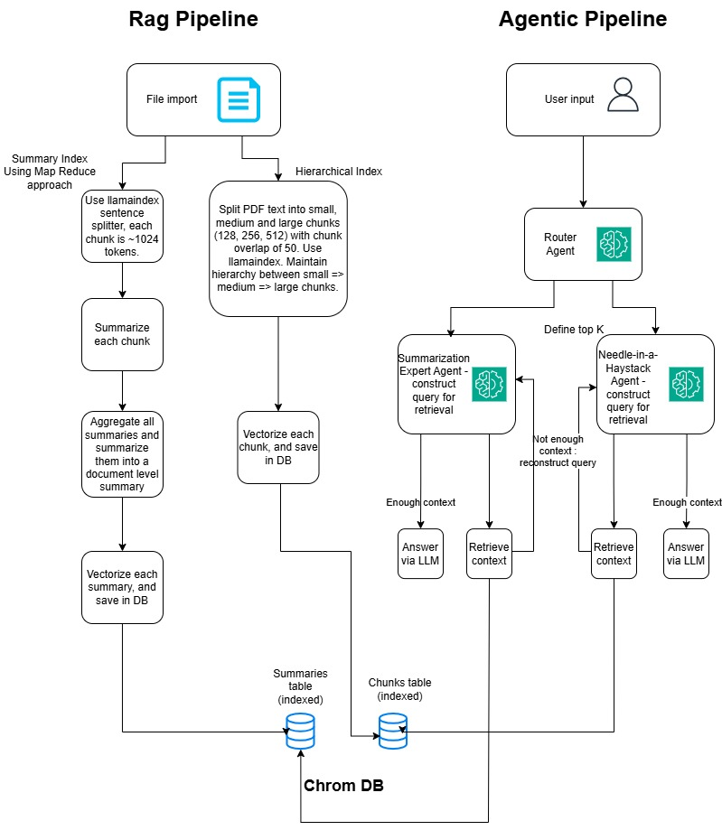
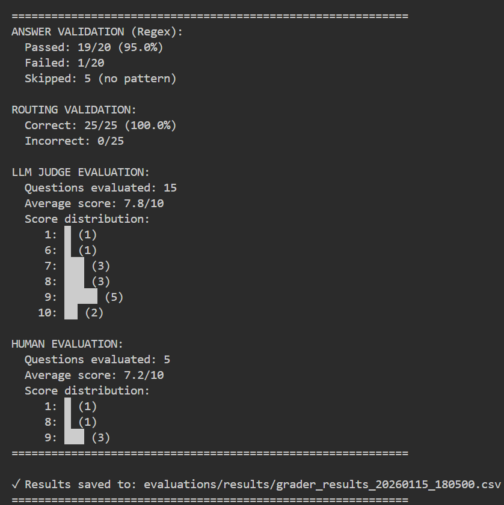

# Agentic RAG System

A Retrieval-Augmented Generation (RAG) system that uses hierarchical chunking, summarization, and intelligent routing to answer questions from insurance claim documents. The system combines LlamaIndex for document processing, ChromaDB for vector storage, and LangChain agents for intelligent query routing and response generation.

## Overview

This system processes PDF documents through multiple pipelines, stores them in ChromaDB, and uses LangChain agents with intelligent routing to retrieve and answer questions. The system is evaluated using RAGAS metrics.

## High Level Architecture



The system follows a two-stage architecture:

**RAG Pipeline (Data Ingestion):**
`PDF Document → Hierarchical Chunking & Summarization → ChromaDB (Chunks & Summaries Collections)`

**Agentic Pipeline (Query Processing):**
`User Query → Router Agent → Expert Agents (Summary/Needle) → Context Retrieval → LLM Response → Evaluation`

## Components

### 1. Data Ingestion

The ingestion process uses **LlamaIndex** to process PDFs and stores them in **ChromaDB** using two pipelines:

#### Hierarchical Chunks Pipeline

-   Processes documents using HierarchicalNodeParser to create chunks at multiple granularity levels (large, medium, small)
-   Stores hierarchical chunks in the chunks collection in ChromaDB
-   Only leaf nodes are stored in the vector store; all nodes (including parent nodes) are stored in the docstore for auto-merging retrieval

**Chunk Sizes:**

-   **Small chunks**: 128 tokens - Fine-grained chunks for precise information retrieval
-   **Medium chunks**: 256 tokens - Balanced chunks for moderate detail queries
-   **Large chunks**: 512 tokens - Broad chunks for context-rich retrieval
-   **Chunk overlap**: 50 tokens - Ensures continuity between adjacent chunks and prevents information loss at boundaries

The hierarchical structure creates parent-child relationships: large chunks contain medium chunks, which in turn contain small chunks. This enables the Auto-Merging Retriever to intelligently combine smaller retrieved chunks back into their parent contexts when multiple siblings are found, providing optimal context for the LLM.

#### Summaries Pipeline

-   Generates summaries using MapReduce approach with SentenceSplitter
-   Creates two types of summaries:
    -   **Chunk-level summaries**: Summaries for individual document sections
    -   **Document-level summaries**: High-level overview summaries for entire documents
-   Stores summaries in the summaries collection in ChromaDB

**Summary Chunking:**

-   **Chunk size**: 1024 tokens - Larger chunks optimized for summarization tasks
-   **Chunk overlap**: 200 tokens - Ensures comprehensive coverage when generating summaries
-   These larger chunks are processed through the MapReduce approach: each chunk is summarized individually, then all summaries are aggregated and summarized again to create document-level summaries

Both pipelines run during ingestion, creating two separate vector store collections, optimized for different query types.

### 2. Retrieval

The system uses two retrieval strategies:

#### Summary Index Retrieval

-   Uses SummariesRetriever to search the summaries collection
-   Optimized for high-level, overview questions
-   Returns document-level or chunk-level summaries based on query specificity
-   Best suited for main key events, timelines, and general information queries

#### Chunks Index Retrieval (Auto-Merging)

-   Uses AutoMergingRetriever to search the chunks collection
-   Retrieves leaf nodes and automatically merges them back into parent nodes when multiple siblings are retrieved
-   Optimized for specific, detailed questions requiring exact information extraction
-   Leverages the hierarchical structure stored in the docstore

### 3. Agents

Built with **LangChain**, the system uses three types of agents:

#### Query Router Agent

-   Analyzes user queries and determines the appropriate retrieval strategy
-   Routes queries to either chunks (auto-merging) or summaries retrieval
-   Uses LLM-based decision making to select the best strategy

#### Needle Agent

-   Handles specific, detailed queries requiring precise information extraction
-   Uses AutoMergingRetriever to find exact information from hierarchical chunks
-   Best for questions requiring exact facts, numbers, dates, or specific details
-   If insufficient context is retrieved, the agent will reconstruct the query and retry

#### Summary Agent

-   Handles broad, overview queries requiring high-level understanding
-   Uses SummariesRetriever to retrieve summary information
-   Has two retrieval tools:
    -   `retrieve_context`: Retrieves document-level summaries for very broad questions
    -   `retrieve_detailed_context`: Retrieves chunk-level summaries for specific but high-level questions
-   If insufficient context is retrieved, the agent will reconstruct the query and retry

All agents use LangChain's agent framework with tool calling to retrieve context and generate answers.

### 4. Evaluation

The system provides two evaluation approaches:

#### RAGAS Evaluation

Uses **RAGAS** (Retrieval-Augmented Generation Assessment) framework for automated evaluation:

-   **Metrics**: answer correctness, faithfulness, context precision
-   **Dataset**: Pre-defined questions with ground truth answers (`evaluations/dataset.py`)
-   **Process**:
    1. Query Router Agent processes each question
    2. Retrieves contexts and generates answers
    3. RAGAS evaluates answers against ground truth
    4. Results saved to CSV files with timestamps

#### Multi-Grader Evaluation

Comprehensive evaluation system using multiple grader types (`evaluations/graders.py`):

**1. Code-Based Grader (Regex Pattern Matching)**

-   Validates factual answers using regex patterns
-   Tests 20 questions requiring specific facts (numbers, dates, names, IDs)
-   Provides immediate pass/fail results with extracted values
-   Best for verifying exact information retrieval

**2. LLM-as-Judge (Gemini 2.5 Flash)**

-   Evaluates answer quality and completeness using LLM
-   Assesses 15 questions with ground truth references
-   Provides scores (1-10) and detailed feedback
-   Evaluates both factual accuracy and comprehensiveness

**3. Human-in-the-Loop**

-   Interactive evaluation for 5 selected questions (3 needle + 2 summary)
-   Requires human evaluator to provide score (1-10) and feedback
-   Captures subjective quality aspects (clarity, relevance, completeness)
-   Essential for validating answer quality from user perspective

**4. Routing Validation**

-   Tests if queries are routed to the correct agent (needle vs summary)
-   Validates 25 questions with expected routing strategies
-   Ensures router agent makes appropriate decisions

**Dataset**: 25 questions (`evaluations/graders_dataset.py`) with regex patterns, ground truth, and expected routing

**Output**: CSV files with detailed results and summary statistics per grader type



## Setup

### 1. Create Virtual Environment

```bash
python -m venv venv
```

### 2. Activate Virtual Environment

**Windows (PowerShell):**

```powershell
.\venv\Scripts\Activate.ps1
```

**Windows (Command Prompt):**

```cmd
venv\Scripts\activate.bat
```

**Linux/Mac:**

```bash
source venv/bin/activate
```

### 3. Install Dependencies

```bash
pip install -r requirements.txt
```

### 4. Environment Variables

Create a `.env` file in the project root with your OpenAI API key:

```
OPENAI_API_KEY=your_api_key_here
GOOGLE_API_KEY=your_api_key_here
```

## Usage

### Data Ingestion

Process PDF documents and store them in ChromaDB. You must run two separate commands - one for chunks and one for summaries:

**Step 1: Generate hierarchical chunks:**

```bash
python src/data_ingestion/pipeline.py --pdf "path/to/file.pdf" --chunks
```

**Step 2: Generate summaries:**

```bash
python src/data_ingestion/pipeline.py --pdf "path/to/file.pdf" --summaries
```

**Example:**

```bash
# Generate chunks
python src/data_ingestion/pipeline.py --pdf "data/raw/Insurance_Claim_Report_Comprehensive.pdf" --chunks

# Generate summaries
python src/data_ingestion/pipeline.py --pdf "data/raw/Insurance_Claim_Report_Comprehensive.pdf" --summaries
```

This will create hierarchical chunks and summaries separately in ChromaDB, ready for retrieval.

### Query Processing

Run interactive queries using the agent system:

```bash
python src/agents/main.py
```

The system will prompt you for queries, route them to the appropriate agent, and return answers based on the retrieved context.

### Evaluation

The system provides two evaluation approaches:

**RAGAS Evaluation (Automated):**

```bash
python evaluations/main.py
```

Processes 10 questions, evaluates with RAGAS metrics (answer correctness, faithfulness, context precision), and saves results to CSV.

**Multi-Grader Evaluation (Comprehensive):**

```bash
python evaluations/graders.py
```

Evaluates 25 questions using four validation methods:

-   Regex pattern matching for factual accuracy
-   LLM-as-judge for answer quality and completeness
-   Human-in-the-loop for subjective evaluation (requires interactive input)
-   Routing validation to ensure correct agent selection

Results include detailed per-question scores and summary statistics, saved to `evaluations/results/grader_results_*.csv`.

## Configuration

All settings are configured in `config/config.yaml`. Key configuration sections include:

-   **LLM settings**: Model selection (default: `gpt-4o-mini`), temperature, and embedding model
-   **Chunking parameters**: Hierarchical chunk sizes (128, 256, 512 tokens) and overlap (50 tokens)
-   **Vector store settings**: ChromaDB persistence directory and collection names
-   **Summarization settings**: Chunk size (1024 tokens) and overlap (200 tokens) for summary generation
-   **Retrieval settings**: Default top-k retrieval parameters

See `config/config.yaml` for all available options and their descriptions.

## Dependencies

Key dependencies include:

-   **LlamaIndex**: Document processing, hierarchical chunking, and node parsing
-   **ChromaDB**: Persistent vector storage for embeddings
-   **LangChain**: Agent framework and tool calling infrastructure
-   **RAGAS**: Evaluation metrics for RAG system assessment
-   **OpenAI**: LLM inference and text embeddings
-   **PyMuPDF**: PDF text extraction and processing

See `requirements.txt` for the complete list of dependencies and versions.
